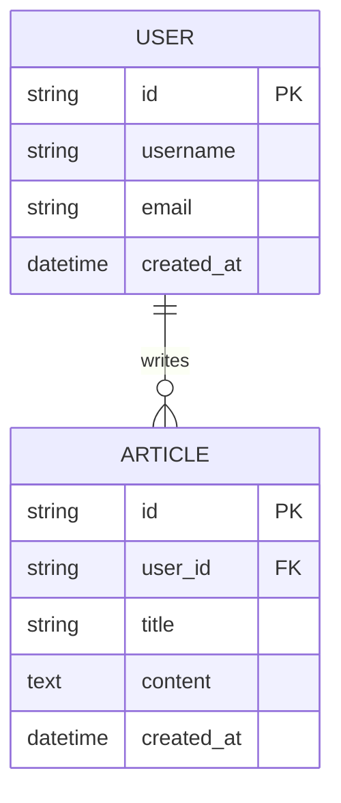
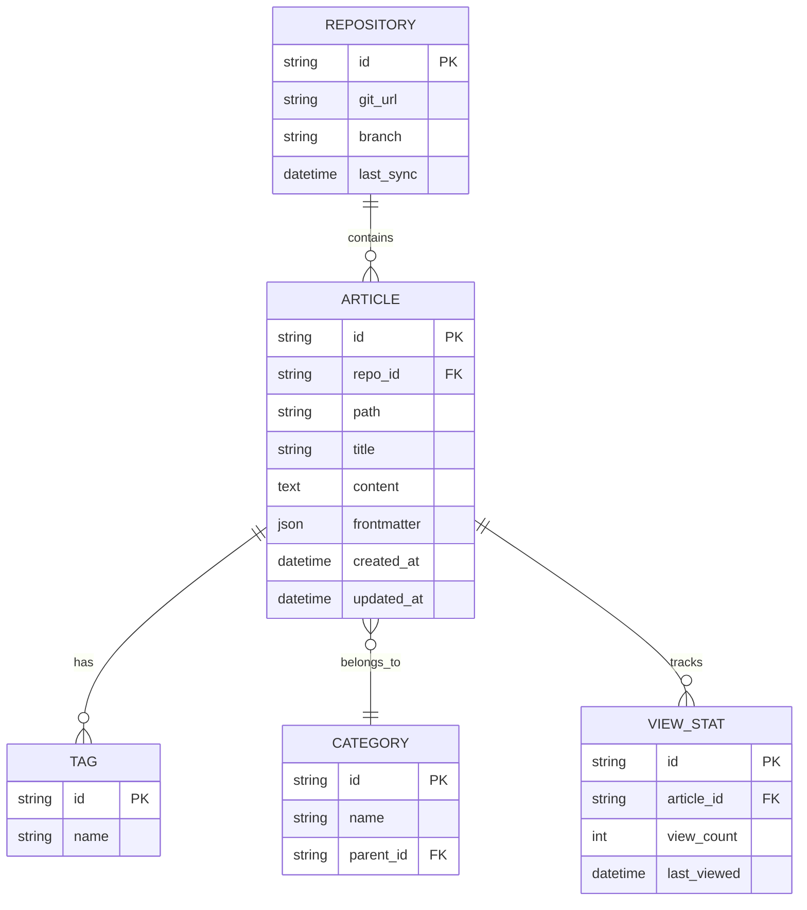
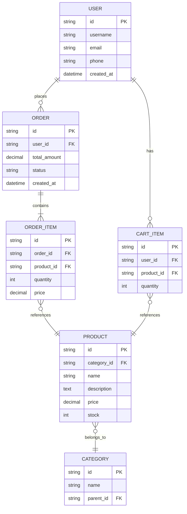
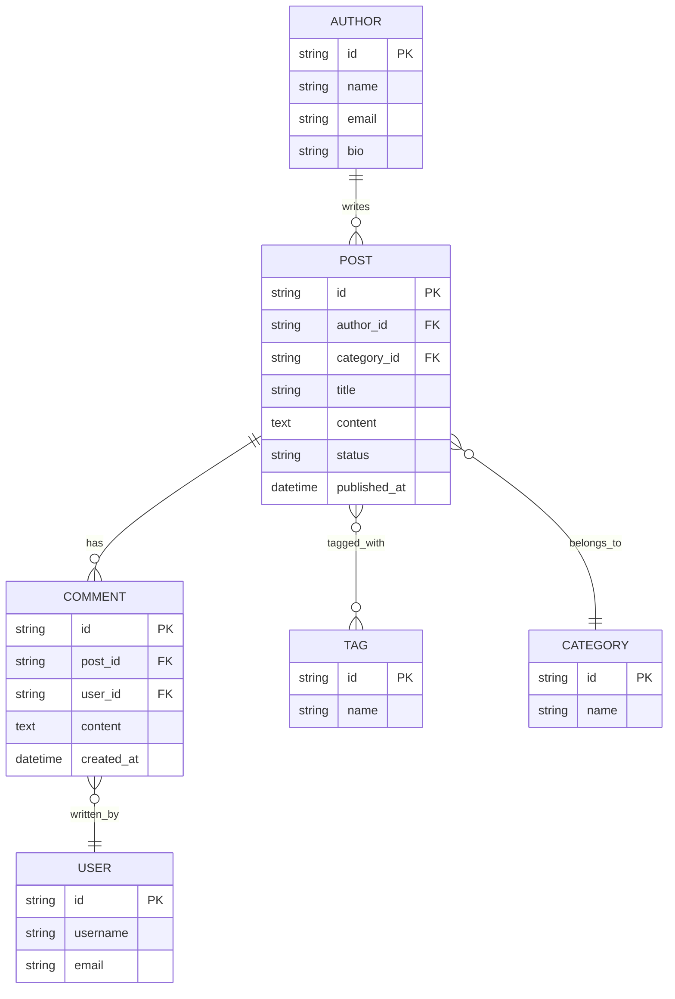
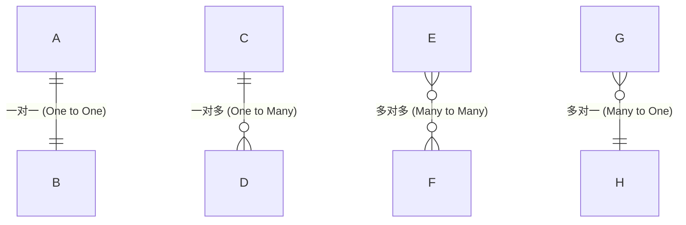
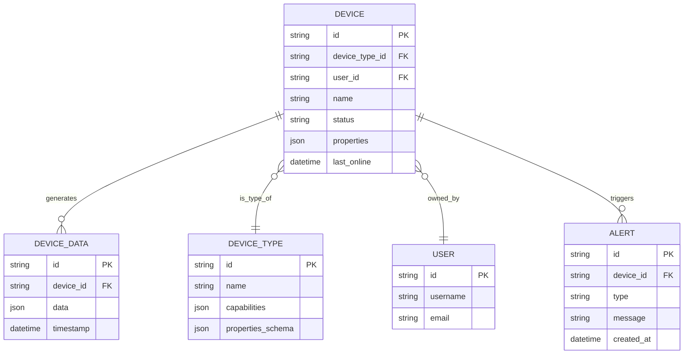
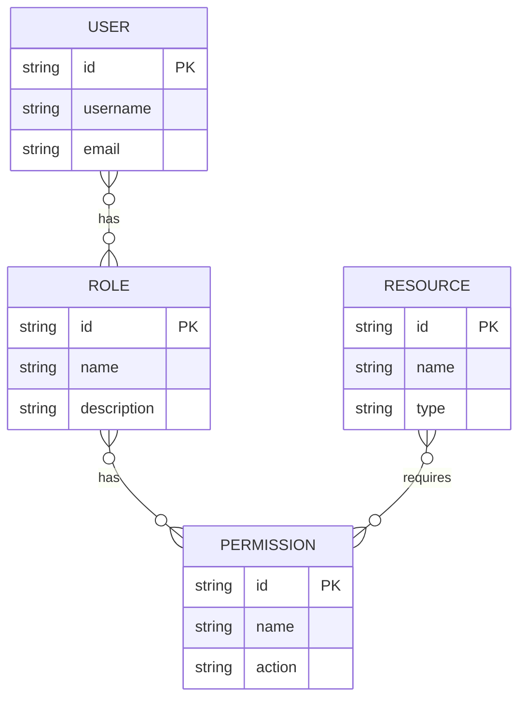

# 实体关系图演示

Mermaid 实体关系图用于展示数据库设计和实体之间的关系。

## 基础 ER 图

```mermaid
erDiagram
    USER ||--o{ ARTICLE : writes
    USER {
        string id PK
        string username
        string email
        datetime created_at
    }
    ARTICLE {
        string id PK
        string user_id FK
        string title
        text content
        datetime created_at
    }
```

## PowerWiki 数据模型

```mermaid
erDiagram
    REPOSITORY ||--o{ ARTICLE : contains
    ARTICLE ||--o{ TAG : has
    ARTICLE }o--|| CATEGORY : belongs_to
    ARTICLE ||--o{ VIEW_STAT : tracks
    
    REPOSITORY {
        string id PK
        string git_url
        string branch
        datetime last_sync
    }
    
    ARTICLE {
        string id PK
        string repo_id FK
        string path
        string title
        text content
        json frontmatter
        datetime created_at
        datetime updated_at
    }
    
    TAG {
        string id PK
        string name
    }
    
    CATEGORY {
        string id PK
        string name
        string parent_id FK
    }
    
    VIEW_STAT {
        string id PK
        string article_id FK
        int view_count
        datetime last_viewed
    }
```

## 电商系统数据模型

```mermaid
erDiagram
    USER ||--o{ ORDER : places
    ORDER ||--|{ ORDER_ITEM : contains
    ORDER_ITEM }o--|| PRODUCT : references
    PRODUCT }o--|| CATEGORY : belongs_to
    USER ||--o{ CART_ITEM : has
    CART_ITEM }o--|| PRODUCT : references
    
    USER {
        string id PK
        string username
        string email
        string phone
        datetime created_at
    }
    
    ORDER {
        string id PK
        string user_id FK
        decimal total_amount
        string status
        datetime created_at
    }
    
    ORDER_ITEM {
        string id PK
        string order_id FK
        string product_id FK
        int quantity
        decimal price
    }
    
    PRODUCT {
        string id PK
        string category_id FK
        string name
        text description
        decimal price
        int stock
    }
    
    CATEGORY {
        string id PK
        string name
        string parent_id FK
    }
    
    CART_ITEM {
        string id PK
        string user_id FK
        string product_id FK
        int quantity
    }
```

## 博客系统数据模型

```mermaid
erDiagram
    AUTHOR ||--o{ POST : writes
    POST ||--o{ COMMENT : has
    COMMENT }o--|| USER : written_by
    POST }o--o{ TAG : tagged_with
    POST }o--|| CATEGORY : belongs_to
    
    AUTHOR {
        string id PK
        string name
        string email
        string bio
    }
    
    POST {
        string id PK
        string author_id FK
        string category_id FK
        string title
        text content
        string status
        datetime published_at
    }
    
    COMMENT {
        string id PK
        string post_id FK
        string user_id FK
        text content
        datetime created_at
    }
    
    USER {
        string id PK
        string username
        string email
    }
    
    TAG {
        string id PK
        string name
    }
    
    CATEGORY {
        string id PK
        string name
    }
```

## 关系类型说明

```mermaid
erDiagram
    A ||--|| B : "一对一 (One to One)"
    C ||--o{ D : "一对多 (One to Many)"
    E }o--o{ F : "多对多 (Many to Many)"
    G }o--|| H : "多对一 (Many to One)"
```

## 物联网设备管理

```mermaid
erDiagram
    DEVICE ||--o{ DEVICE_DATA : generates
    DEVICE }o--|| DEVICE_TYPE : is_type_of
    DEVICE }o--|| USER : owned_by
    DEVICE ||--o{ ALERT : triggers
    
    DEVICE {
        string id PK
        string device_type_id FK
        string user_id FK
        string name
        string status
        json properties
        datetime last_online
    }
    
    DEVICE_TYPE {
        string id PK
        string name
        json capabilities
        json properties_schema
    }
    
    DEVICE_DATA {
        string id PK
        string device_id FK
        json data
        datetime timestamp
    }
    
    USER {
        string id PK
        string username
        string email
    }
    
    ALERT {
        string id PK
        string device_id FK
        string type
        string message
        datetime created_at
    }
```

## 权限管理系统

```mermaid
erDiagram
    USER }o--o{ ROLE : has
    ROLE }o--o{ PERMISSION : has
    RESOURCE }o--o{ PERMISSION : requires
    
    USER {
        string id PK
        string username
        string email
    }
    
    ROLE {
        string id PK
        string name
        string description
    }
    
    PERMISSION {
        string id PK
        string name
        string action
    }
    
    RESOURCE {
        string id PK
        string name
        string type
    }
```

---

**提示**: 实体关系图适合展示数据库设计、数据模型、实体关联等。使用清晰的命名和合适的关系类型。
