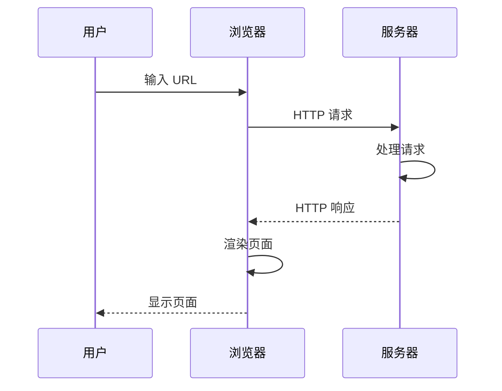
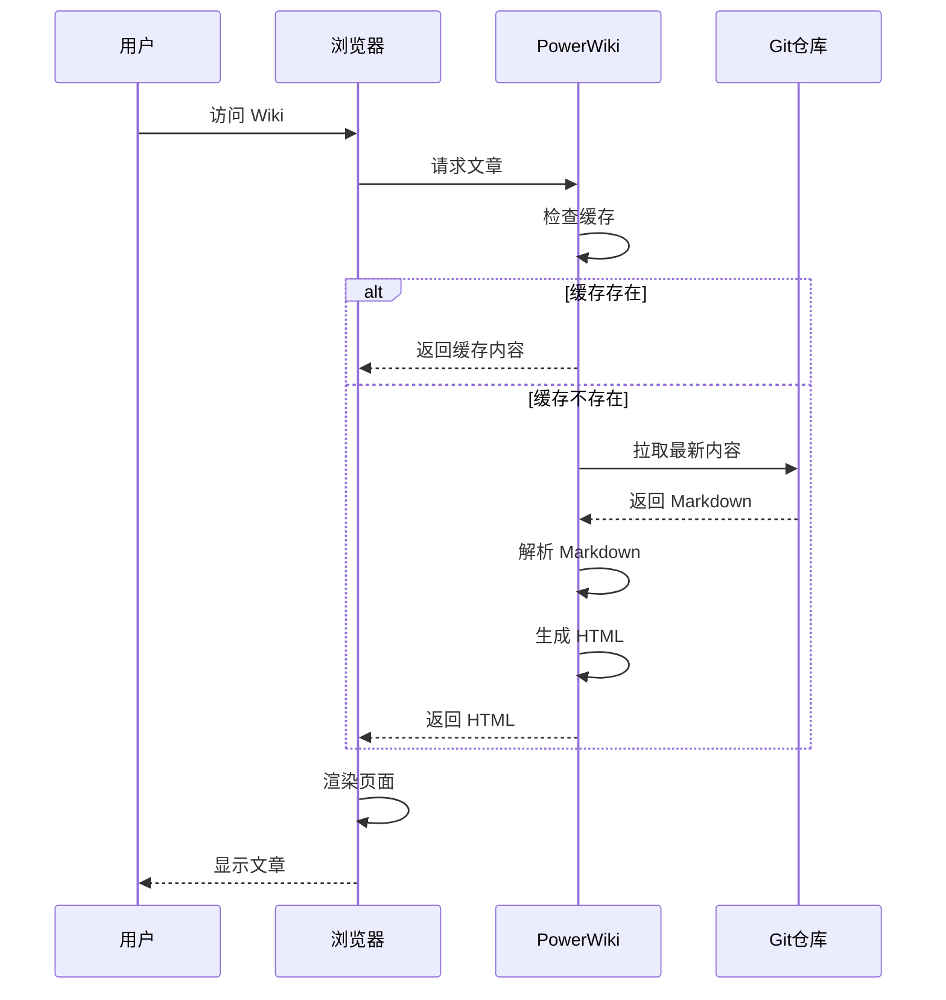
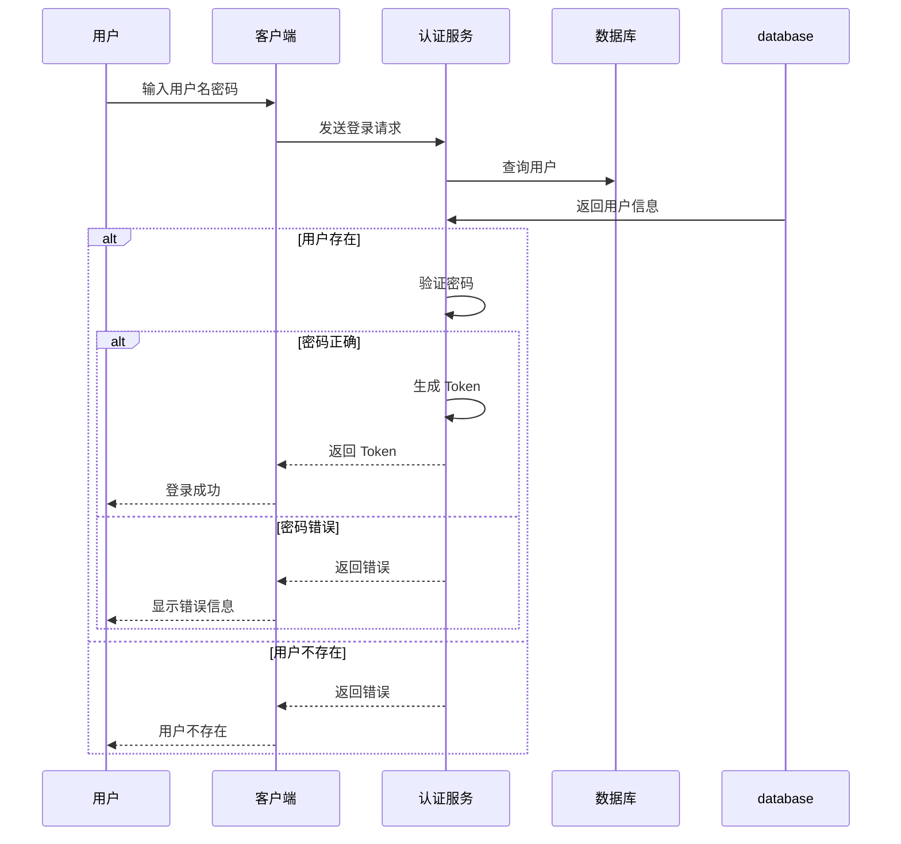
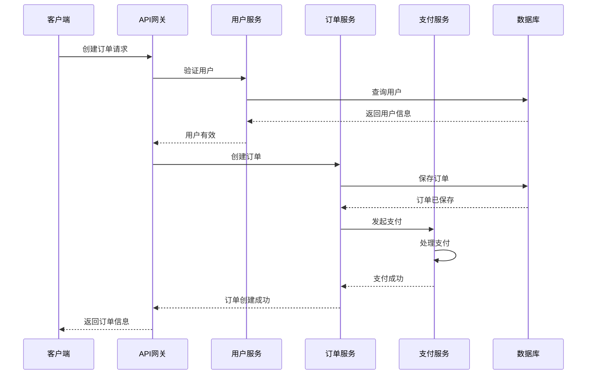
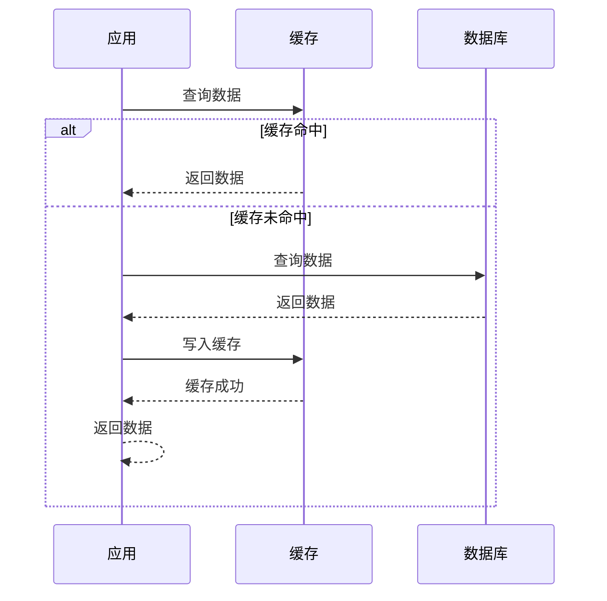
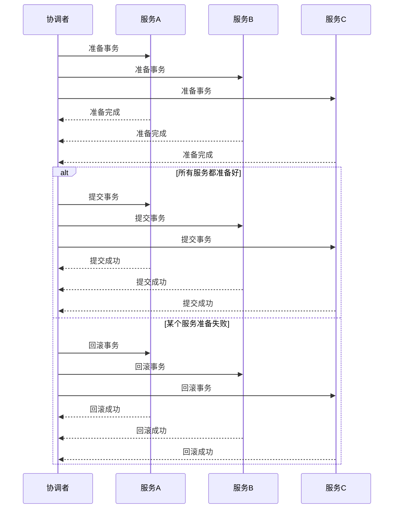
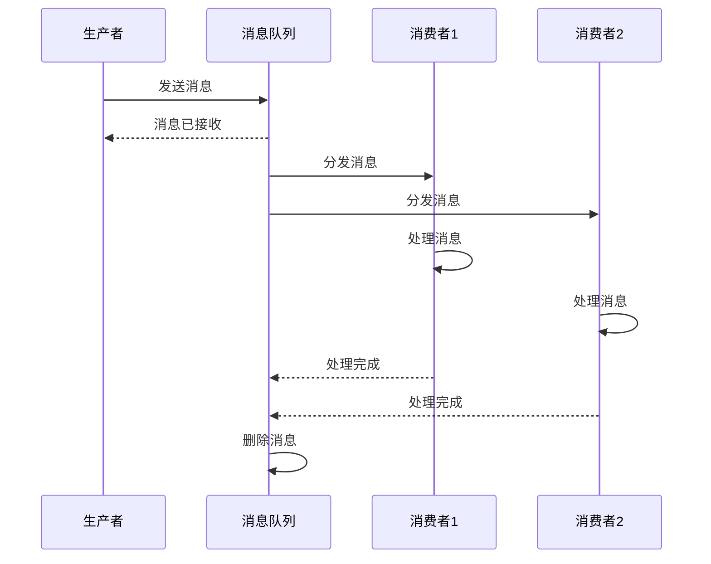
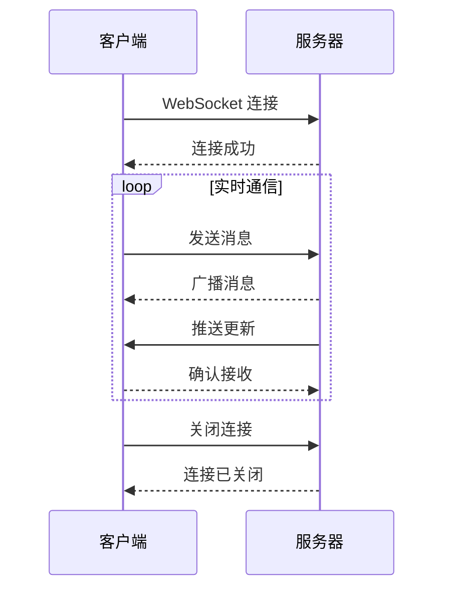

# 时序图演示

Mermaid 时序图用于展示系统间的交互、API 调用等时间序列关系。

## 基础时序图

## PowerWiki 工作流程

## 用户认证流程

## 微服务调用链

## 缓存更新流程

## 分布式事务

## 异步消息处理

## WebSocket 实时通信

---

**提示**: 时序图适合展示系统间的交互、API 调用、业务流程等。使用箭头表示消息流向，虚线表示返回。
