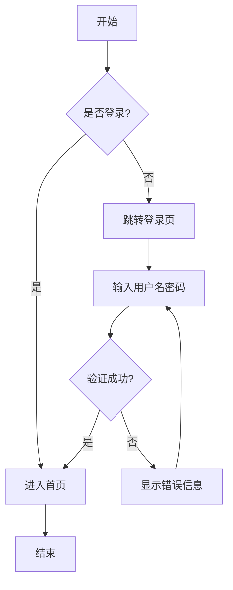
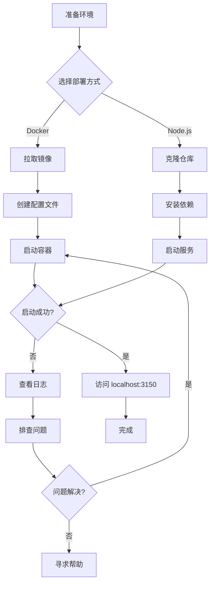
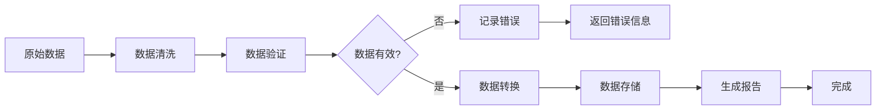
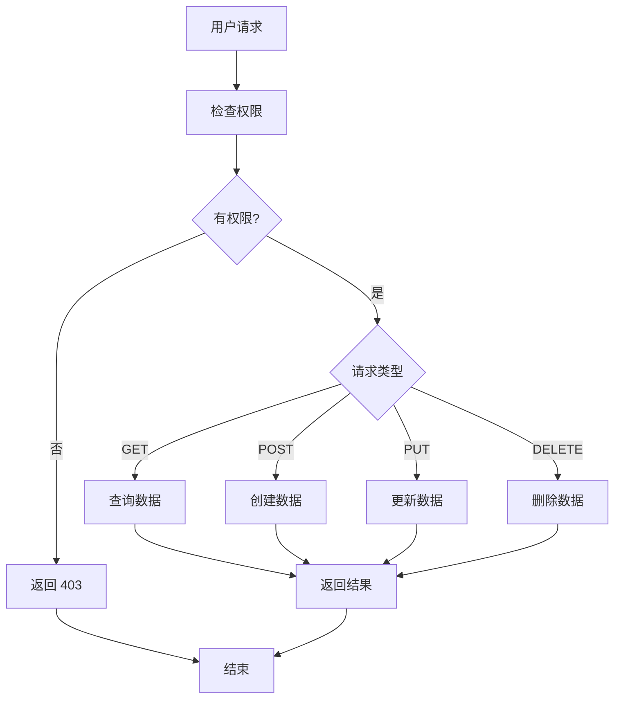
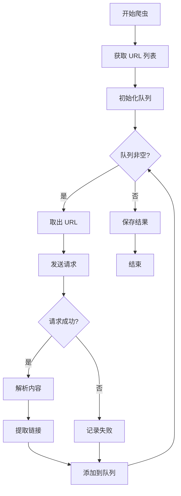
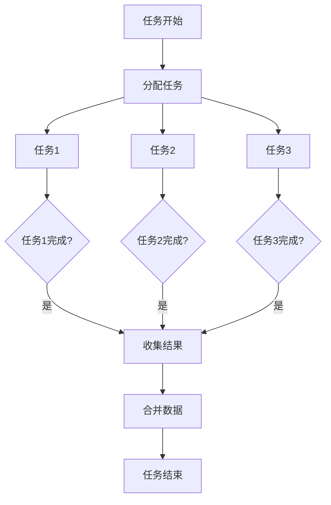
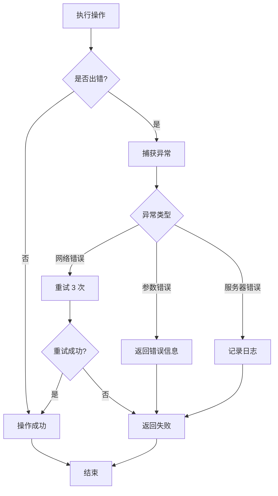
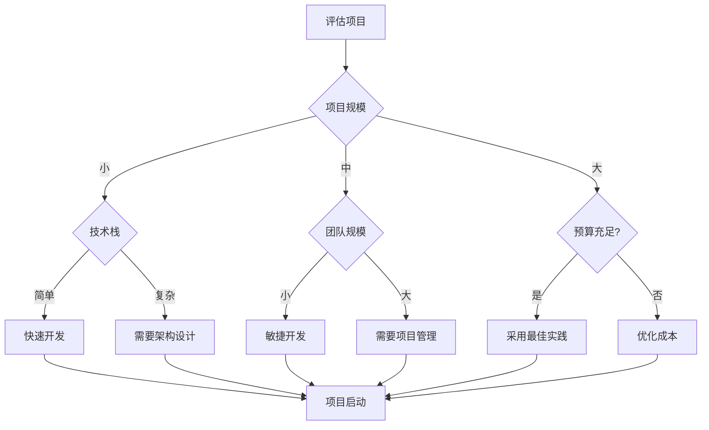

# 流程图演示

Mermaid 流程图用于展示业务流程、算法流程等。

## 基础流程图

```mermaid
flowchart TD
    A[开始] --> B{是否登录?}
    B -->|是| C[进入首页]
    B -->|否| D[跳转登录页]
    D --> E[输入用户名密码]
    E --> F{验证成功?}
    F -->|是| C
    F -->|否| G[显示错误信息]
    G --> E
    C --> H[结束]
```

## PowerWiki 部署流程

```mermaid
flowchart TD
    A[准备环境] --> B{选择部署方式}
    B -->|Docker| C[拉取镜像]
    B -->|Node.js| D[克隆仓库]
    C --> E[创建配置文件]
    D --> F[安装依赖]
    E --> G[启动容器]
    F --> H[启动服务]
    G --> I{启动成功?}
    H --> I
    I -->|是| J[访问 localhost:3150]
    I -->|否| K[查看日志]
    K --> L[排查问题]
    L --> M{问题解决?}
    M -->|是| G
    M -->|否| N[寻求帮助]
    J --> O[完成]
```

## 数据处理流程

```mermaid
flowchart LR
    A[原始数据] --> B[数据清洗]
    B --> C[数据验证]
    C --> D{数据有效?}
    D -->|否| E[记录错误]
    E --> F[返回错误信息]
    D -->|是| G[数据转换]
    G --> H[数据存储]
    H --> I[生成报告]
    I --> J[完成]
```

## 条件分支流程

```mermaid
flowchart TD
    A[用户请求] --> B[检查权限]
    B --> C{有权限?}
    C -->|否| D[返回 403]
    C -->|是| E{请求类型}
    E -->|GET| F[查询数据]
    E -->|POST| G[创建数据]
    E -->|PUT| H[更新数据]
    E -->|DELETE| I[删除数据]
    F --> J[返回结果]
    G --> J
    H --> J
    I --> J
    D --> K[结束]
    J --> K
```

## 循环流程

```mermaid
flowchart TD
    A[开始爬虫] --> B[获取 URL 列表]
    B --> C[初始化队列]
    C --> D{队列非空?}
    D -->|是| E[取出 URL]
    E --> F[发送请求]
    F --> G{请求成功?}
    G -->|否| H[记录失败]
    G -->|是| I[解析内容]
    I --> J[提取链接]
    J --> K[添加到队列]
    H --> K
    K --> D
    D -->|否| L[保存结果]
    L --> M[结束]
```

## 并行流程

```mermaid
flowchart TD
    A[任务开始] --> B[分配任务]
    B --> C[任务1]
    B --> D[任务2]
    B --> E[任务3]
    C --> F{任务1完成?}
    D --> G{任务2完成?}
    E --> H{任务3完成?}
    F -->|是| I[收集结果]
    G -->|是| I
    H -->|是| I
    I --> J[合并数据]
    J --> K[任务结束]
```

## 错误处理流程

```mermaid
flowchart TD
    A[执行操作] --> B{是否出错?}
    B -->|否| C[操作成功]
    B -->|是| D[捕获异常]
    D --> E{异常类型}
    E -->|网络错误| F[重试 3 次]
    E -->|参数错误| G[返回错误信息]
    E -->|服务器错误| H[记录日志]
    F --> I{重试成功?}
    I -->|是| C
    I -->|否| J[返回失败]
    G --> J
    H --> J
    C --> K[结束]
    J --> K
```

## 决策树

```mermaid
flowchart TD
    A[评估项目] --> B{项目规模}
    B -->|小| C{技术栈}
    B -->|中| D{团队规模}
    B -->|大| E{预算充足?}
    C -->|简单| F[快速开发]
    C -->|复杂| G[需要架构设计]
    D -->|小| H[敏捷开发]
    D -->|大| I[需要项目管理]
    E -->|是| J[采用最佳实践]
    E -->|否| K[优化成本]
    F --> L[项目启动]
    G --> L
    H --> L
    I --> L
    J --> L
    K --> L
```

---

**提示**: 流程图适合展示业务流程、系统流程、算法流程等。使用菱形表示决策点，矩形表示操作步骤。
