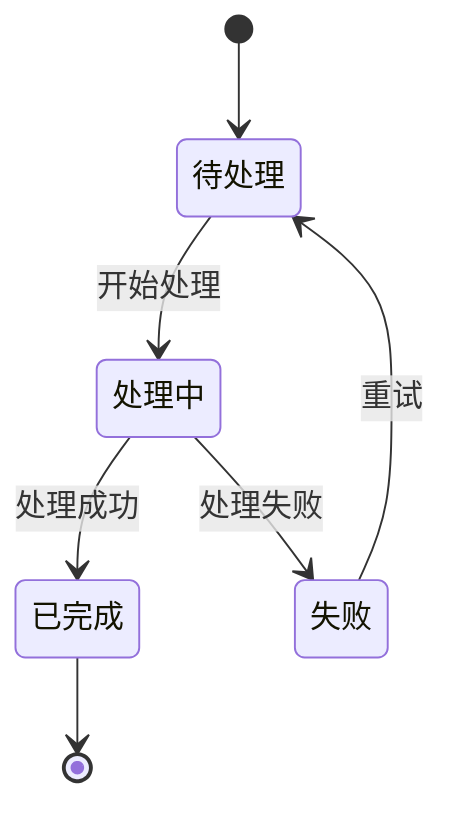
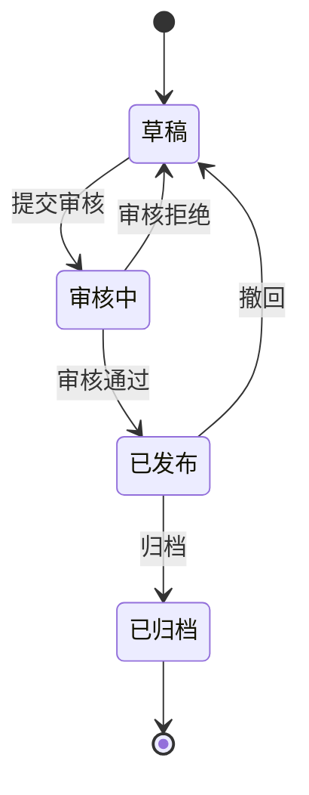
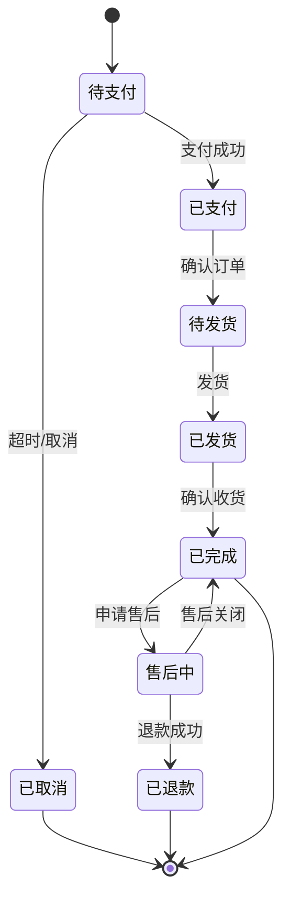
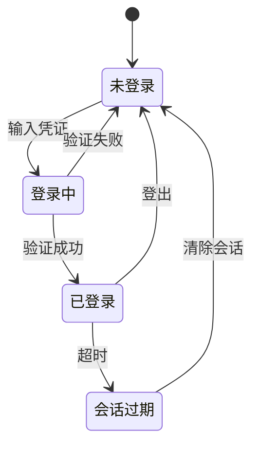
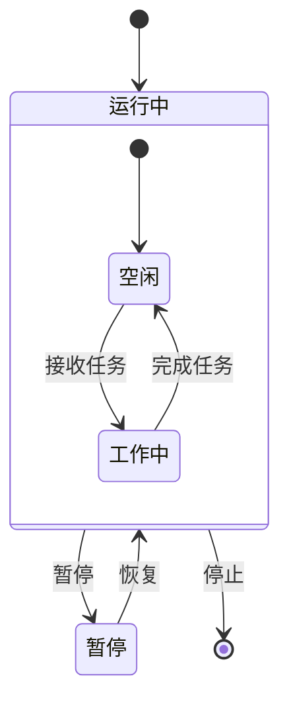
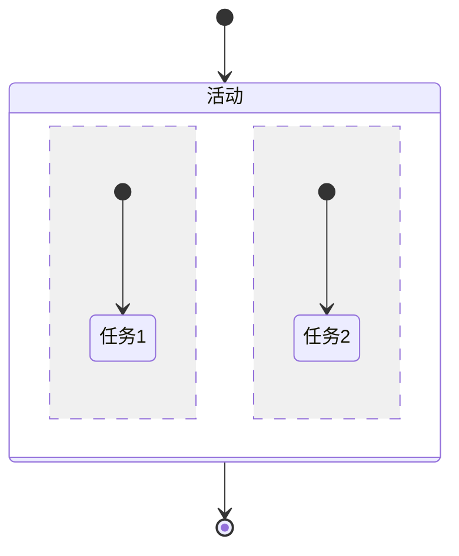
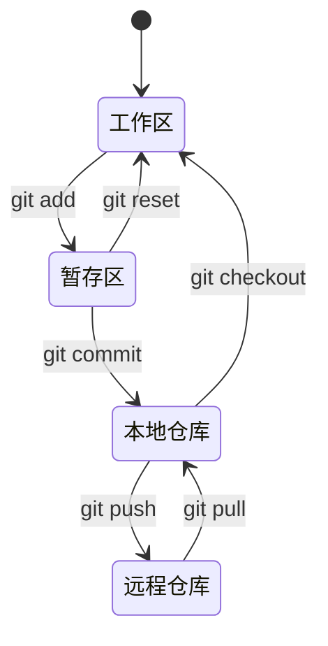
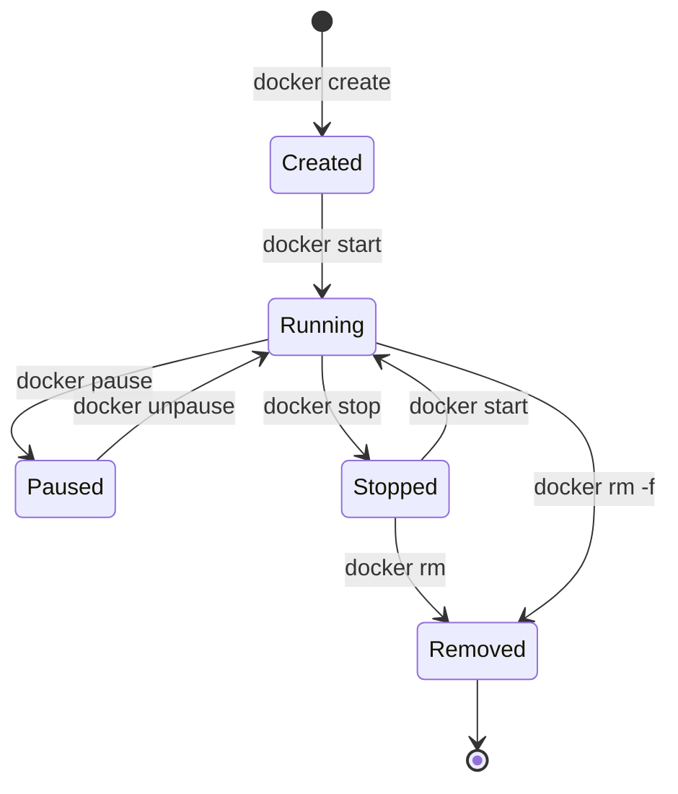

# 状态图演示

Mermaid 状态图用于展示对象的状态转换和生命周期。

## 基础状态图

## PowerWiki 文章状态

## 订单状态流转

## 用户登录状态

## 复合状态

## 并发状态

## Git 工作流状态

## Docker 容器状态

---

**提示**: 状态图适合展示对象的生命周期、工作流程、状态转换等。使用清晰的状态名称和转换条件。
