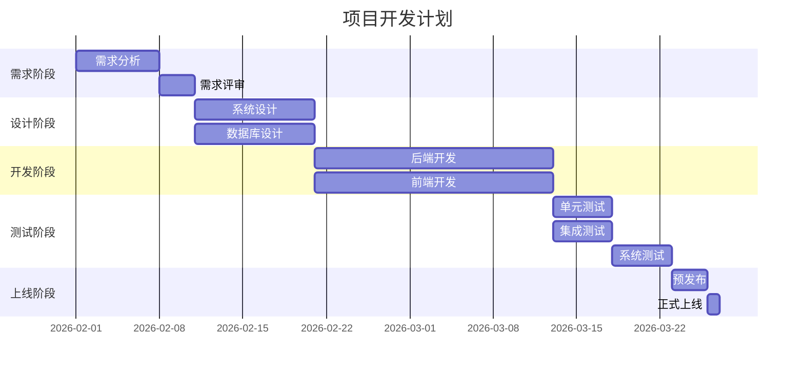
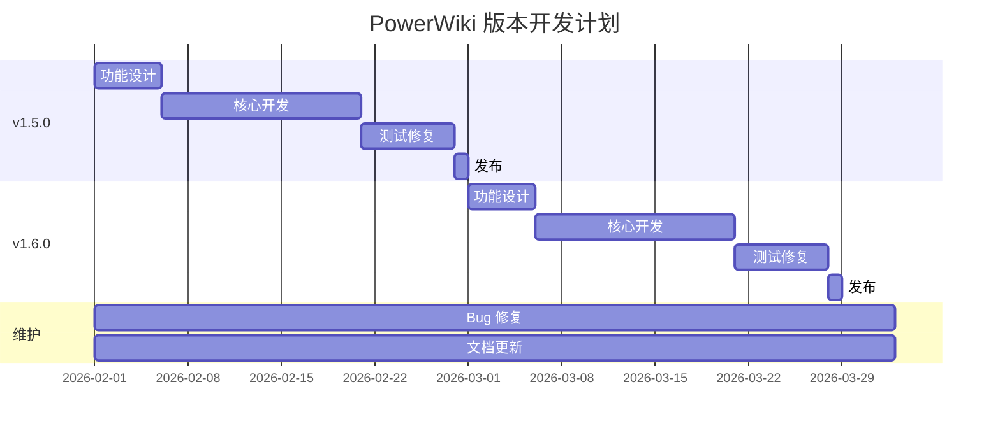
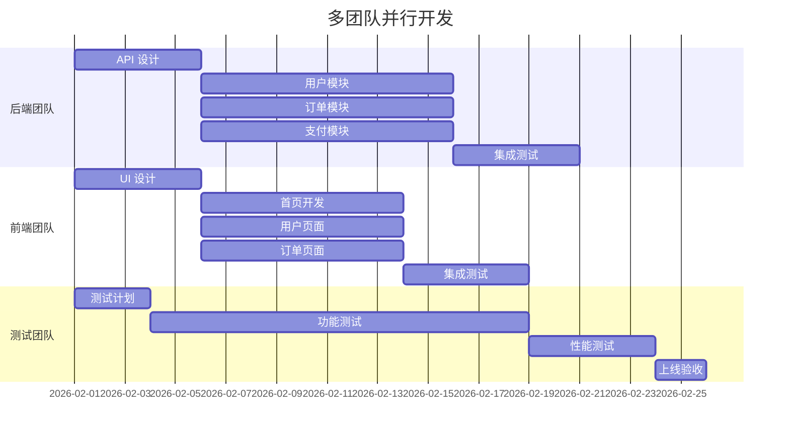
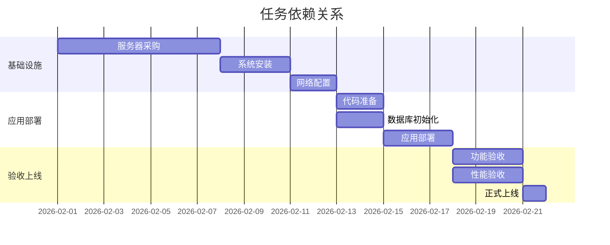
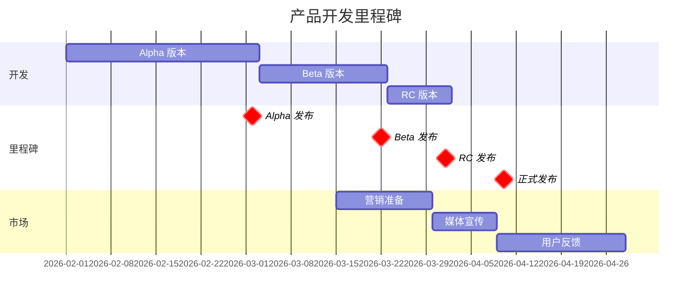
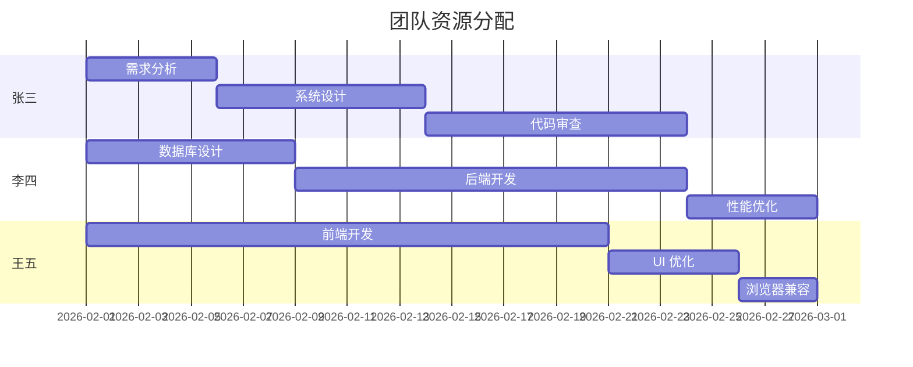
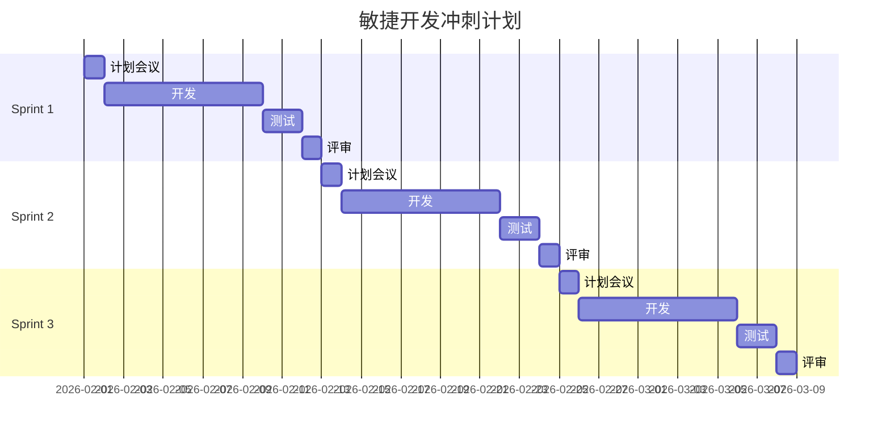

# 甘特图演示

Mermaid 甘特图用于项目计划、时间管理、任务调度等。

## 基础甘特图

```mermaid
gantt
    title 项目开发计划
    dateFormat YYYY-MM-DD
    
    section 需求阶段
    需求分析           :a1, 2026-02-01, 7d
    需求评审           :a2, after a1, 3d
    
    section 设计阶段
    系统设计           :b1, after a2, 10d
    数据库设计         :b2, after a2, 10d
    
    section 开发阶段
    后端开发           :c1, after b1, 20d
    前端开发           :c2, after b1, 20d
    
    section 测试阶段
    单元测试           :d1, after c1, 5d
    集成测试           :d2, after c2, 5d
    系统测试           :d3, after d1, 5d
    
    section 上线阶段
    预发布             :e1, after d3, 3d
    正式上线           :e2, after e1, 1d
```

## PowerWiki 开发计划

```mermaid
gantt
    title PowerWiki 版本开发计划
    dateFormat YYYY-MM-DD
    
    section v1.5.0
    功能设计           :v150_design, 2026-02-01, 5d
    核心开发           :v150_dev, after v150_design, 15d
    测试修复           :v150_test, after v150_dev, 7d
    发布               :v150_release, after v150_test, 1d
    
    section v1.6.0
    功能设计           :v160_design, after v150_release, 5d
    核心开发           :v160_dev, after v160_design, 15d
    测试修复           :v160_test, after v160_dev, 7d
    发布               :v160_release, after v160_test, 1d
    
    section 维护
    Bug 修复           :maintain, 2026-02-01, 60d
    文档更新           :doc, 2026-02-01, 60d
```

## 并行任务计划

```mermaid
gantt
    title 多团队并行开发
    dateFormat YYYY-MM-DD
    
    section 后端团队
    API 设计           :backend_design, 2026-02-01, 5d
    用户模块           :backend_user, after backend_design, 10d
    订单模块           :backend_order, after backend_design, 10d
    支付模块           :backend_pay, after backend_design, 10d
    集成测试           :backend_test, after backend_user, 5d
    
    section 前端团队
    UI 设计            :frontend_design, 2026-02-01, 5d
    首页开发           :frontend_home, after frontend_design, 8d
    用户页面           :frontend_user, after frontend_design, 8d
    订单页面           :frontend_order, after frontend_design, 8d
    集成测试           :frontend_test, after frontend_home, 5d
    
    section 测试团队
    测试计划           :test_plan, 2026-02-01, 3d
    功能测试           :test_func, after test_plan, 15d
    性能测试           :test_perf, after test_func, 5d
    上线验收           :test_accept, after test_perf, 2d
```

## 依赖关系甘特图

```mermaid
gantt
    title 任务依赖关系
    dateFormat YYYY-MM-DD
    
    section 基础设施
    服务器采购         :infra_buy, 2026-02-01, 7d
    系统安装           :infra_install, after infra_buy, 3d
    网络配置           :infra_network, after infra_install, 2d
    
    section 应用部署
    代码准备           :app_code, after infra_network, 2d
    数据库初始化       :app_db, after infra_network, 2d
    应用部署           :app_deploy, after app_code, 3d
    
    section 验收上线
    功能验收           :accept_func, after app_deploy, 3d
    性能验收           :accept_perf, after app_deploy, 3d
    正式上线           :accept_online, after accept_func, 1d
```

## 里程碑计划

```mermaid
gantt
    title 产品开发里程碑
    dateFormat YYYY-MM-DD
    
    section 开发
    Alpha 版本         :alpha, 2026-02-01, 30d
    Beta 版本          :beta, after alpha, 20d
    RC 版本            :rc, after beta, 10d
    
    section 里程碑
    Alpha 发布         :crit, milestone, 2026-03-02, 0d
    Beta 发布          :crit, milestone, 2026-03-22, 0d
    RC 发布            :crit, milestone, 2026-04-01, 0d
    正式发布           :crit, milestone, 2026-04-10, 0d
    
    section 市场
    营销准备           :market_prep, 2026-03-15, 15d
    媒体宣传           :market_media, after market_prep, 10d
    用户反馈           :market_feedback, after market_media, 20d
```

## 资源分配甘特图

```mermaid
gantt
    title 团队资源分配
    dateFormat YYYY-MM-DD
    
    section 张三
    需求分析           :person1_req, 2026-02-01, 5d
    系统设计           :person1_design, after person1_req, 8d
    代码审查           :person1_review, after person1_design, 10d
    
    section 李四
    数据库设计         :person2_db, 2026-02-01, 8d
    后端开发           :person2_dev, after person2_db, 15d
    性能优化           :person2_opt, after person2_dev, 5d
    
    section 王五
    前端开发           :person3_dev, 2026-02-01, 20d
    UI 优化            :person3_ui, after person3_dev, 5d
    浏览器兼容         :person3_compat, after person3_ui, 3d
```

## 敏捷冲刺计划

```mermaid
gantt
    title 敏捷开发冲刺计划
    dateFormat YYYY-MM-DD
    
    section Sprint 1
    计划会议           :sprint1_plan, 2026-02-01, 1d
    开发               :sprint1_dev, after sprint1_plan, 8d
    测试               :sprint1_test, after sprint1_dev, 2d
    评审               :sprint1_review, after sprint1_test, 1d
    
    section Sprint 2
    计划会议           :sprint2_plan, after sprint1_review, 1d
    开发               :sprint2_dev, after sprint2_plan, 8d
    测试               :sprint2_test, after sprint2_dev, 2d
    评审               :sprint2_review, after sprint2_test, 1d
    
    section Sprint 3
    计划会议           :sprint3_plan, after sprint2_review, 1d
    开发               :sprint3_dev, after sprint3_plan, 8d
    测试               :sprint3_test, after sprint3_dev, 2d
    评审               :sprint3_review, after sprint3_test, 1d
```

---

**提示**: 甘特图适合展示项目计划、时间管理、任务调度等。使用里程碑标记重要节点，使用依赖关系表示任务顺序。
