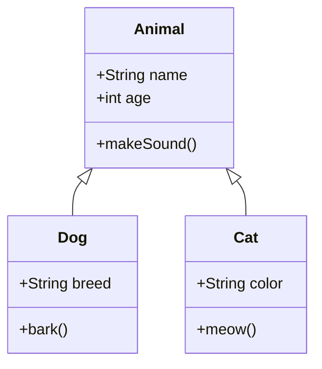
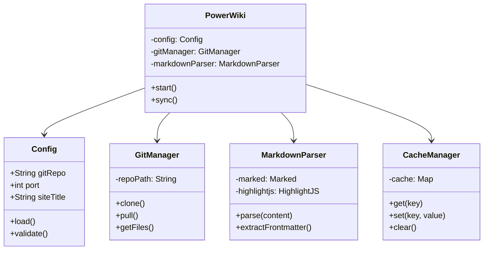
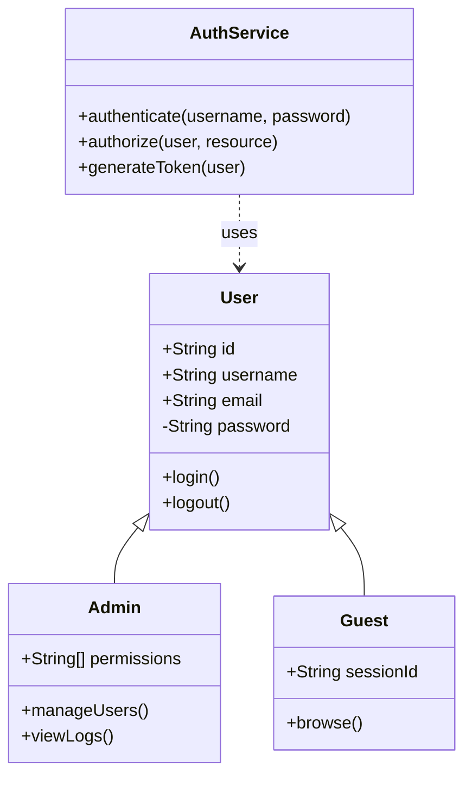
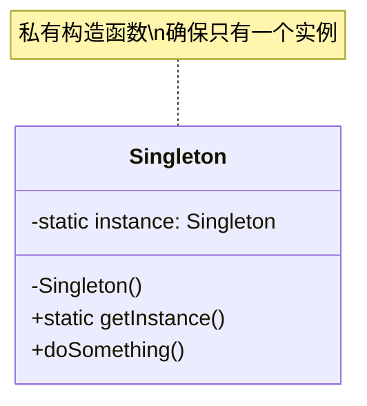
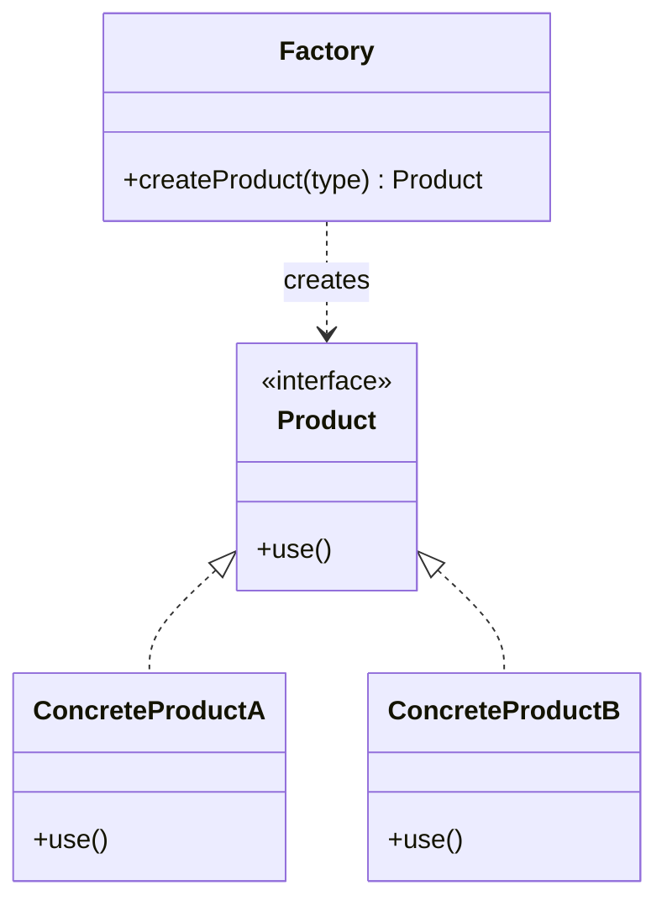
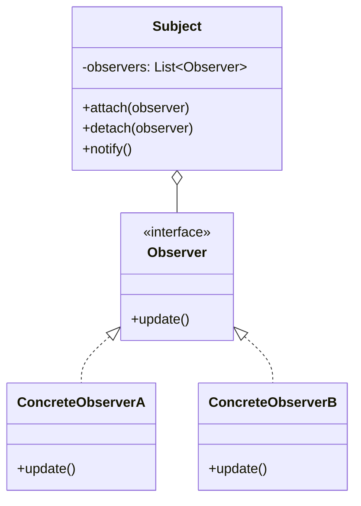
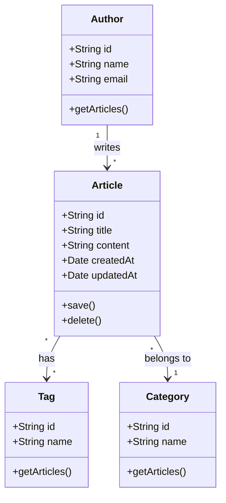
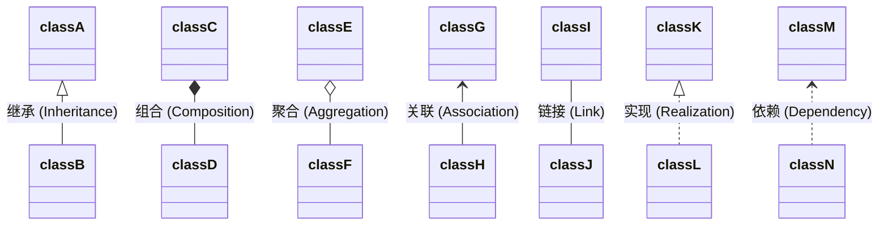
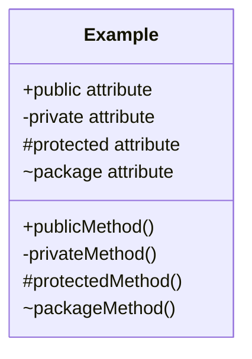

# 类图演示

Mermaid 类图用于展示面向对象设计中的类结构和关系。

## 基础类图

## PowerWiki 架构类图

## 用户认证系统

## 设计模式 - 单例模式

## 设计模式 - 工厂模式

## 设计模式 - 观察者模式

## 数据库模型

## 关系类型说明

## 可见性修饰符

---

**提示**: 类图适合展示面向对象设计、系统架构、设计模式等。使用不同的关系类型表达类之间的关联。
