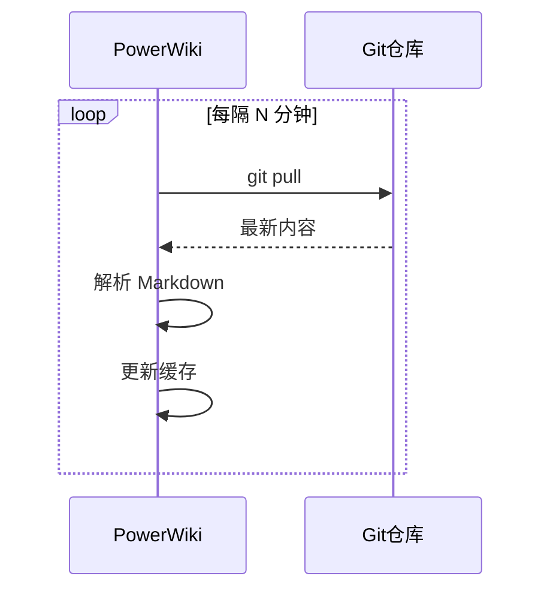

# 自动同步机制

PowerWiki 会定期自动从 Git 仓库同步最新内容，无需手动刷新。

## 工作原理



## 配置同步间隔

在 `config.json` 中配置：

```json
{
  "autoSyncInterval": 180000
}
```

单位为毫秒：
- 60000 = 1 分钟
- 180000 = 3 分钟（默认）
- 300000 = 5 分钟

## 手动触发同步

重启 PowerWiki 容器会立即触发同步：

```bash
docker restart powerwiki
```

## 同步日志

查看同步日志：

```bash
docker logs -f powerwiki | grep sync
```

## 注意事项

1. **同步间隔不宜过短** - 避免频繁访问 Git 仓库
2. **大仓库同步较慢** - 首次克隆可能需要较长时间
3. **网络问题** - 确保 PowerWiki 可以访问 Git 仓库

---

**提示**: 合理配置同步间隔，平衡实时性和性能。
