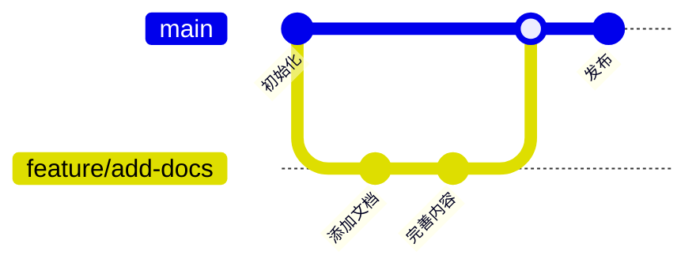
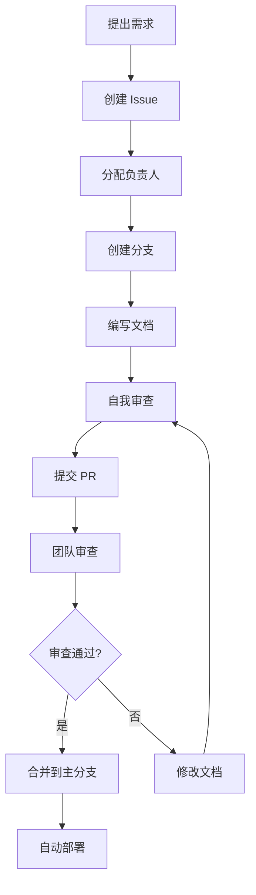

# 团队协作最佳实践

PowerWiki 基于 Git，天然支持团队协作。本文介绍如何高效地进行团队文档协作。

## 🔄 Git 工作流

### 1. 功能分支工作流



**流程**:
```bash
# 1. 创建功能分支
git checkout -b feature/add-api-docs

# 2. 编写文档
# 编辑 Markdown 文件

# 3. 提交更改
git add .
git commit -m "docs: 添加 API 文档"

# 4. 推送到远程
git push origin feature/add-api-docs

# 5. 创建 Pull Request
# 在 GitHub 上创建 PR

# 6. 代码审查后合并
git checkout main
git pull origin main
```

### 2. Git Flow 工作流

```
main (生产环境)
  ↑
develop (开发环境)
  ↑
feature/* (功能分支)
```

**适用场景**: 大型团队，需要严格的发布流程

### 3. GitHub Flow 工作流

```
main
  ↑
feature-branch → PR → merge
```

**适用场景**: 小型团队，快速迭代

## 📝 文档规范

### 1. Commit 规范

使用约定式提交（Conventional Commits）：

```bash
# 格式
<type>(<scope>): <subject>

# 类型
docs: 文档更新
feat: 新增功能文档
fix: 修复文档错误
style: 格式调整
refactor: 重构文档结构
chore: 其他更改

# 示例
docs(api): 添加用户认证接口文档
fix(deploy): 修正 Docker 部署步骤
style(readme): 调整目录格式
```

### 2. 分支命名规范

```bash
# 功能分支
feature/add-deployment-guide
feature/update-api-docs

# 修复分支
fix/correct-typo
fix/update-broken-links

# 文档分支
docs/add-best-practices
docs/update-readme
```

### 3. Pull Request 规范

**PR 标题**:
```
docs: 添加 Kubernetes 部署指南
fix: 修正 Docker 配置示例
feat: 新增团队协作文档
```

**PR 描述模板**:
```markdown
## 变更说明
简要描述本次变更的内容。

## 变更类型
- [ ] 新增文档
- [ ] 更新文档
- [ ] 修复错误
- [ ] 重构结构

## 检查清单
- [ ] 文档格式正确
- [ ] 链接有效
- [ ] 图片可访问
- [ ] 代码示例可运行
- [ ] 已添加 Frontmatter

## 相关 Issue
Closes #123
```

## 👥 角色和权限

### 1. 角色定义

| 角色 | 权限 | 职责 |
|------|------|------|
| 管理员 | 完全权限 | 仓库管理、权限分配 |
| 维护者 | 合并 PR | 审查文档、合并变更 |
| 贡献者 | 提交 PR | 编写和更新文档 |
| 阅读者 | 只读 | 查看文档 |

### 2. GitHub 权限设置

```bash
# 添加协作者
Settings → Collaborators → Add people

# 设置分支保护
Settings → Branches → Add rule
- Require pull request reviews
- Require status checks
- Require signed commits
```

## 📋 协作流程

### 1. 文档创建流程



### 2. 文档审查流程

**审查要点**:
- [ ] 内容准确性
- [ ] 格式规范性
- [ ] 链接有效性
- [ ] 代码可运行性
- [ ] 图片清晰度
- [ ] 语法正确性

**审查评论模板**:
```markdown
## 审查意见

### 优点
- 内容详实，示例清晰
- 格式规范，易于阅读

### 建议
- [ ] 第 10 行：建议添加代码注释
- [ ] 第 25 行：链接失效，需要更新
- [ ] 建议添加架构图

### 总体评价
LGTM（Looks Good To Me）/ 需要修改
```

## 🔔 通知和沟通

### 1. GitHub 通知

```bash
# 订阅仓库通知
Watch → All Activity

# 提及团队成员
@username 请审查这个文档

# 提及团队
@team/docs-team 请审查
```

### 2. 集成工具

**Slack 集成**:
```yaml
# .github/workflows/notify.yml
name: Notify Slack
on: [pull_request]
jobs:
  notify:
    runs-on: ubuntu-latest
    steps:
      - name: Slack Notification
        uses: 8398a7/action-slack@v3
```

**钉钉/企业微信集成**:
使用 Webhook 发送通知

## 📊 协作指标

### 1. 文档质量指标

- 文档覆盖率
- 更新频率
- 审查通过率
- 问题解决时间

### 2. 团队协作指标

- PR 数量
- 审查响应时间
- 合并时间
- 贡献者数量

## 🛠️ 协作工具

### 1. GitHub Projects

创建项目看板管理文档任务：

```
待办 | 进行中 | 审查中 | 已完成
-----|--------|--------|--------
任务1 | 任务2  | 任务3  | 任务4
```

### 2. GitHub Issues

使用 Issue 模板：

```markdown
---
name: 文档需求
about: 提出新的文档需求
---

## 文档类型
- [ ] 新增文档
- [ ] 更新文档
- [ ] 修复错误

## 文档描述
描述需要创建或更新的文档内容。

## 优先级
- [ ] 高
- [ ] 中
- [ ] 低

## 截止日期
YYYY-MM-DD
```

### 3. GitHub Actions

自动化工作流：

```yaml
# .github/workflows/check-links.yml
name: Check Links
on: [pull_request]
jobs:
  check:
    runs-on: ubuntu-latest
    steps:
      - uses: actions/checkout@v2
      - name: Check links
        uses: gaurav-nelson/github-action-markdown-link-check@v1
```

## 💡 协作技巧

### 1. 小步提交

```bash
# 好的做法
git commit -m "docs: 添加 Docker 部署章节"
git commit -m "docs: 添加配置说明"
git commit -m "docs: 添加故障排查"

# 不好的做法
git commit -m "更新文档"  # 包含多个不相关的更改
```

### 2. 及时同步

```bash
# 定期同步主分支
git checkout main
git pull origin main
git checkout feature-branch
git rebase main
```

### 3. 清晰的沟通

- 在 PR 中详细说明变更原因
- 使用截图展示效果
- 回复审查意见
- 及时更新进度

### 4. 文档模板

创建文档模板，保持一致性：

```
.github/
└── PULL_REQUEST_TEMPLATE.md
└── ISSUE_TEMPLATE/
    ├── bug_report.md
    ├── feature_request.md
    └── documentation.md
```

## 🔒 安全和权限

### 1. 敏感信息

- 不要提交密码、密钥
- 使用 `.gitignore` 排除敏感文件
- 使用环境变量存储配置

### 2. 分支保护

```bash
# 保护主分支
- Require pull request reviews before merging
- Require status checks to pass
- Require branches to be up to date
- Include administrators
```

## 📚 参考资源

- [Git 工作流](https://www.atlassian.com/git/tutorials/comparing-workflows)
- [约定式提交](https://www.conventionalcommits.org/)
- [GitHub Flow](https://guides.github.com/introduction/flow/)
- [代码审查最佳实践](https://google.github.io/eng-practices/review/)

---

**提示**: 良好的团队协作需要规范和工具的支持，更需要团队成员的共同努力。
