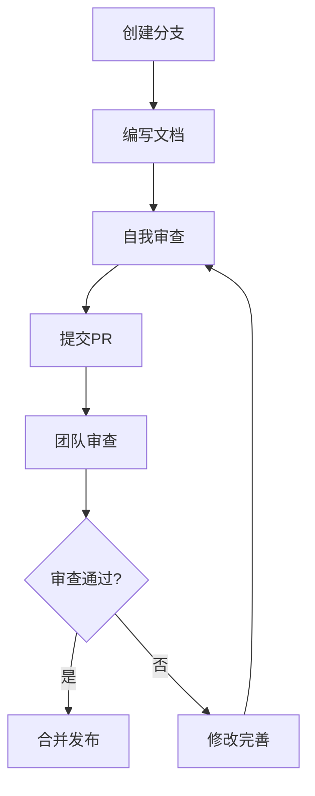

# 团队技术文档案例

本文介绍如何使用 PowerWiki 构建团队技术文档中心。

## 团队概况

- **团队规模**: 10-50 人
- **文档数量**: 500+ 篇
- **更新频率**: 每日更新
- **访问方式**: 内网部署

## 目录结构

```
team-docs/
├── README.md                  # 团队文档首页
├── ABOUT.md                   # 团队介绍
│
├── 团队规范/
│   ├── README.md
│   ├── 代码规范.md
│   ├── Git规范.md
│   ├── API设计规范.md
│   └── 文档规范.md
│
├── 技术架构/
│   ├── README.md
│   ├── 系统架构图.md
│   ├── 技术选型.md
│   ├── 数据库设计.md
│   └── API文档/
│       ├── README.md
│       ├── 用户接口.md
│       └── 订单接口.md
│
├── 开发指南/
│   ├── README.md
│   ├── 环境搭建.md
│   ├── 代码部署.md
│   ├── 调试指南.md
│   └── 常见问题.md
│
├── 项目文档/
│   ├── README.md
│   ├── 项目A/
│   │   ├── README.md
│   │   ├── 需求文档.md
│   │   ├── 技术方案.md
│   │   └── 测试报告.md
│   └── 项目B/
│       └── README.md
│
└── 运维手册/
    ├── README.md
    ├── 部署文档.md
    ├── 监控告警.md
    └── 故障处理.md
```

## 配置文件

```json
{
  "gitRepo": "https://github.com/yourteam/team-docs.git",
  "repoBranch": "main",
  "port": 3150,
  "siteTitle": "团队技术文档",
  "siteDescription": "团队技术文档中心",
  "language": "zh-CN",
  "autoSyncInterval": 60000,
  "pages": {
    "home": "README.md",
    "about": "ABOUT.md"
  }
}
```

## 团队协作流程

### 1. 文档编写流程



### 2. Git 工作流

```bash
# 创建文档分支
git checkout -b docs/add-api-guide

# 编写文档
vim 技术文档.md

# 提交更改
git add .
git commit -m "docs: 添加 API 开发指南"

# 推送并创建 PR
git push origin docs/add-api-guide
```

### 3. 审查要点

- 内容准确性
- 格式规范性
- 链接有效性
- 代码可运行性
- 术语一致性

## 文档类型

### 1. 规范类文档

```markdown
# 代码规范

## 命名规范

### 变量命名
- 使用 camelCase
- 避免缩写
- 语义清晰

### 函数命名
- 使用动词或动词短语
- `getUserById`
- `fetchUserList`

## 代码格式
- 缩进 2 空格
- 行尾不加分号
- 使用单引号
```

### 2. 教程类文档

```markdown
# 环境搭建指南

## 前置要求
- Node.js >= 16.0
- MySQL >= 8.0
- Redis >= 6.0

## 步骤

### 1. 克隆项目
```bash
git clone https://github.com/team/project.git
```

### 2. 安装依赖
```bash
cd project
npm install
```

### 3. 配置环境
```bash
cp .env.example .env
```
```

### 3. API 文档

```markdown
# 用户接口

## 获取用户信息

### 请求
```
GET /api/users/:id
```

### 响应
```json
{
  "code": 0,
  "data": {
    "id": 1,
    "name": "张三",
    "email": "zhangsan@example.com"
  }
}
```

### 错误码
| code | 说明 |
|------|------|
| 404 | 用户不存在 |
| 500 | 服务器错误 |
```

## 权限管理

### GitHub 权限设置

| 角色 | 权限 | 人数 |
|------|------|------|
| Admin | 完全控制 | 3 |
| Maintain | 合并PR | 5 |
| Write | 提交PR | 20 |
| Read | 只读 | 50 |

### 分支保护规则

- main 分支需要 PR 才能合并
- 至少 1 人审查通过
- 所有 CI 检查通过

## 部署架构

```
┌─────────────┐     ┌─────────────┐
│   GitHub    │────▶│   PowerWiki │
│   仓库      │     │   容器      │
└─────────────┘     └─────────────┘
       │                   │
       ▼                   ▼
  自动同步             内网访问
```

## 维护策略

### 1. 文档更新

- 及时更新过时的内容
- 标注最后更新时间
- 记录版本变更

### 2. 质量保证

- 定期审查文档
- 收集反馈意见
- 优化文档结构

### 3. 搜索优化

- 使用清晰的标题
- 添加关键词标签
- 建立文档索引

## 成功指标

| 指标 | 目标 | 当前 |
|------|------|------|
| 文档数量 | 500+ | 520 |
| 更新频率 | 10次/天 | 12 |
| 搜索使用 | 100次/天 | 85 |
| 满意度 | 90%+ | 92% |

## 工具集成

### 1. CI/CD 自动化

```yaml
# .github/workflows/docs.yml
name: Docs CI
on:
  pull_request:
    branches: [main]
jobs:
  check:
    runs-on: ubuntu-latest
    steps:
      - uses: actions/checkout@v2
      - name: Check links
        uses: gaurav-nelson/github-action-markdown-link-check@v1
```

### 2. 通知集成

- PR 创建时通知相关人员
- 文档更新时发送邮件
- 定期汇总文档更新

---

**提示**: 团队文档需要持续的维护和更新，建立规范的流程至关重要。
