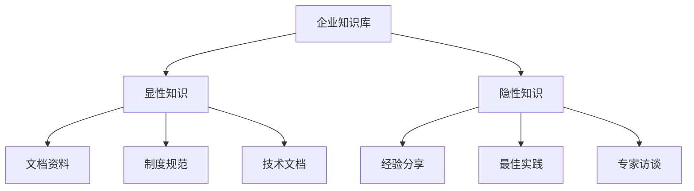
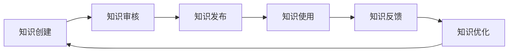
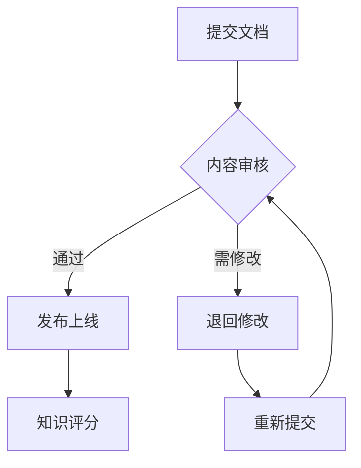
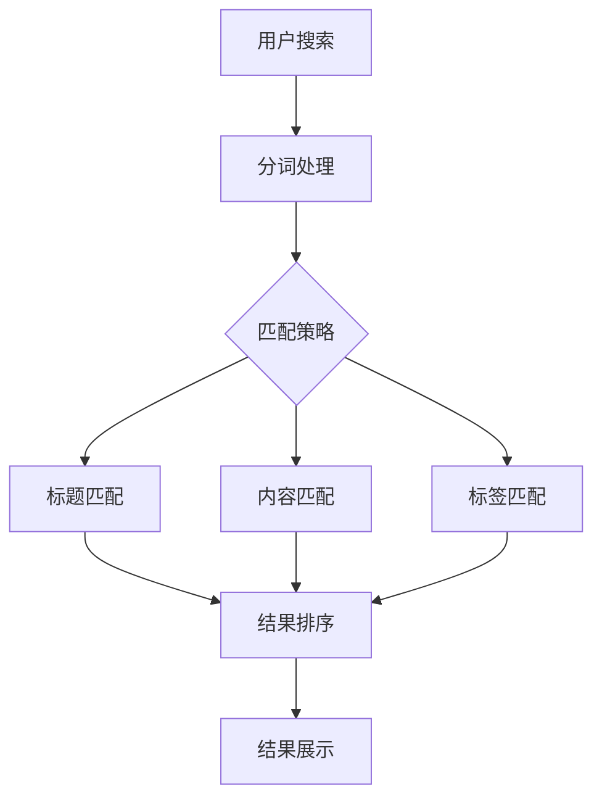

# 企业知识库案例

本文介绍如何使用 PowerWiki 构建企业级知识管理系统。

## 企业概况

- **企业规模**: 200+ 员工
- **部门数量**: 10+ 个部门
- **文档数量**: 2000+ 篇
- **使用场景**: 内部知识共享、培训学习、流程规范

## 目录结构

```
enterprise-wiki/
├── README.md                  # 知识库首页
├── ABOUT.md                   # 关于知识库
│
├── 公司介绍/
│   ├── README.md
│   ├── 公司简介.md
│   ├── 发展历程.md
│   ├── 组织架构.md
│   └── 企业文化.md
│
├── 规章制度/
│   ├── README.md
│   ├── 人事制度/
│   │   ├── 考勤制度.md
│   │   ├── 休假制度.md
│   │   └── 报销制度.md
│   ├── 财务制度/
│   │   └── README.md
│   └── 安全制度/
│       └── README.md
│
├── 产品文档/
│   ├── README.md
│   ├── 产品A/
│   │   ├── README.md
│   │   ├── 产品介绍.md
│   │   ├── 功能手册.md
│   │   └── 常见问题.md
│   └── 产品B/
│       └── README.md
│
├── 技术文档/
│   ├── README.md
│   ├── 开发规范/
│   │   ├── 代码规范.md
│   │   ├── Git规范.md
│   │   └── API规范.md
│   ├── 架构设计/
│   │   ├── 系统架构.md
│   │   └── 技术选型.md
│   └── 运维文档/
│       ├── 部署手册.md
│       └── 故障处理.md
│
├── 培训资料/
│   ├── README.md
│   ├── 新员工培训/
│   │   ├── 入职指南.md
│   │   └── 培训计划.md
│   ├── 技能培训/
│   │   └── README.md
│   └── 管理培训/
│       └── README.md
│
├── 项目文档/
│   ├── README.md
│   └── 项目列表/
│       ├── 项目A/
│       └── 项目B/
│
└── 模板库/
    ├── README.md
    ├── 报告模板/
    ├── 合同模板/
    └── 表格模板/
```

## 知识体系

### 1. 知识分类



### 2. 知识流转



## 权限管理

### 1. 角色定义

| 角色 | 权限 | 适用范围 |
|------|------|---------|
| 超级管理员 | 完全控制 | 全系统 |
| 部门管理员 | 部门管理 | 本部门 |
| 内容编辑 | 创建/编辑 | 授权范围 |
| 内容作者 | 创建/编辑 | 自己的内容 |
| 普通用户 | 只读 | 公开内容 |
| 访客 | 只读 | 公共内容 |

### 2. 部门结构

```
公司
├── 技术研发部
│   ├── 前端组
│   ├── 后端组
│   └── 测试组
├── 产品运营部
├── 市场销售部
├── 人力资源部
└── 财务部
```

### 3. 权限继承

- 公开文档: 所有人可读
- 部门文档: 本部门可读写
- 敏感文档: 指定人员可读写
- 个人文档: 仅本人可读写

## 知识贡献机制

### 1. 激励制度

| 行为 | 积分 | 说明 |
|------|------|------|
| 创建文档 | +10 | 原创内容 |
| 被采纳 | +20 | 被审核通过 |
| 被点赞 | +1 | 每点赞一次 |
| 被收藏 | +2 | 每收藏一次 |
| 贡献者评选 | +100 | 月度优秀 |

### 2. 知识审核



### 3. 知识质量

- **完整性**: 文档结构完整，内容详尽
- **准确性**: 信息准确无误，有据可查
- **时效性**: 内容及时更新，不过时
- **可读性**: 格式规范，易于阅读

## 搜索功能

### 1. 搜索策略



### 2. 搜索优化

- 关键词高亮
- 搜索建议
- 热门搜索
- 搜索历史

### 3. 知识推荐

- 根据岗位推荐
- 根据浏览历史推荐
- 根据部门推荐

## 运营分析

### 1. 数据指标

| 指标 | 说明 | 目标 |
|------|------|------|
| 文档总量 | 知识库文档总数 | 2000+ |
| 日活用户 | 每日访问用户 | 100+ |
| 文档更新 | 每日新增/更新 | 20+ |
| 搜索次数 | 每日搜索次数 | 500+ |
| 下载次数 | 文档下载次数 | 100+ |

### 2. 分析报表

- 部门贡献排行
- 热门文档排行
- 用户活跃度
- 知识增长率

### 3. 优化方向

- 增加优质内容
- 优化搜索体验
- 提升用户参与度
- 完善知识结构

## 应用场景

### 1. 新员工入职

```
入职第一天 ──→ 阅读入职指南 ──→ 了解公司文化
    │                                    │
    ▼                                    ▼
参加培训 ──→ 查阅规章制度 ──→ 快速融入团队
```

### 2. 项目协作

```
项目启动 ──→ 查阅项目模板 ──→ 参考技术文档
    │                                    │
    ▼                                    ▼
团队协作 ──→ 共享项目文档 ──→ 项目顺利交付
```

### 3. 问题解决

```
遇到问题 ──→ 搜索知识库 ──→ 查阅解决方案
    │                                    │
    ▼                                    ▼
无法解决 ──→ 咨询专家 ──→ 补充知识库
```

### 4. 培训学习

```
培训需求 ──→ 查阅培训资料 ──→ 参加培训
    │                                    │
    ▼                                    ▼
技能提升 ──→ 分享学习心得 ──→ 形成知识沉淀
```

## 成功案例

### 案例 1: 研发知识库

- **部门**: 技术研发部
- **规模**: 500+ 篇文档
- **用户**: 50+ 开发者
- **效果**: 开发效率提升 30%

### 案例 2: 产品知识库

- **部门**: 产品运营部
- **规模**: 300+ 篇文档
- **用户**: 30+ 运营人员
- **效果**: 培训成本降低 50%

### 案例 3: 行政知识库

- **部门**: 人力资源部
- **规模**: 200+ 篇文档
- **用户**: 200+ 员工
- **效果**: 咨询工作量减少 40%

## 持续改进

### 1. 知识更新

- 定期审查文档时效性
- 清理过期内容
- 更新过时信息

### 2. 用户反馈

- 收集使用反馈
- 分析用户需求
- 优化用户体验

### 3. 知识创新

- 引入新知识领域
- 探索知识应用
- 推动知识创新

---

**提示**: 企业知识库需要长期的运营和维护，持续的知识贡献和优化才能发挥最大价值。
