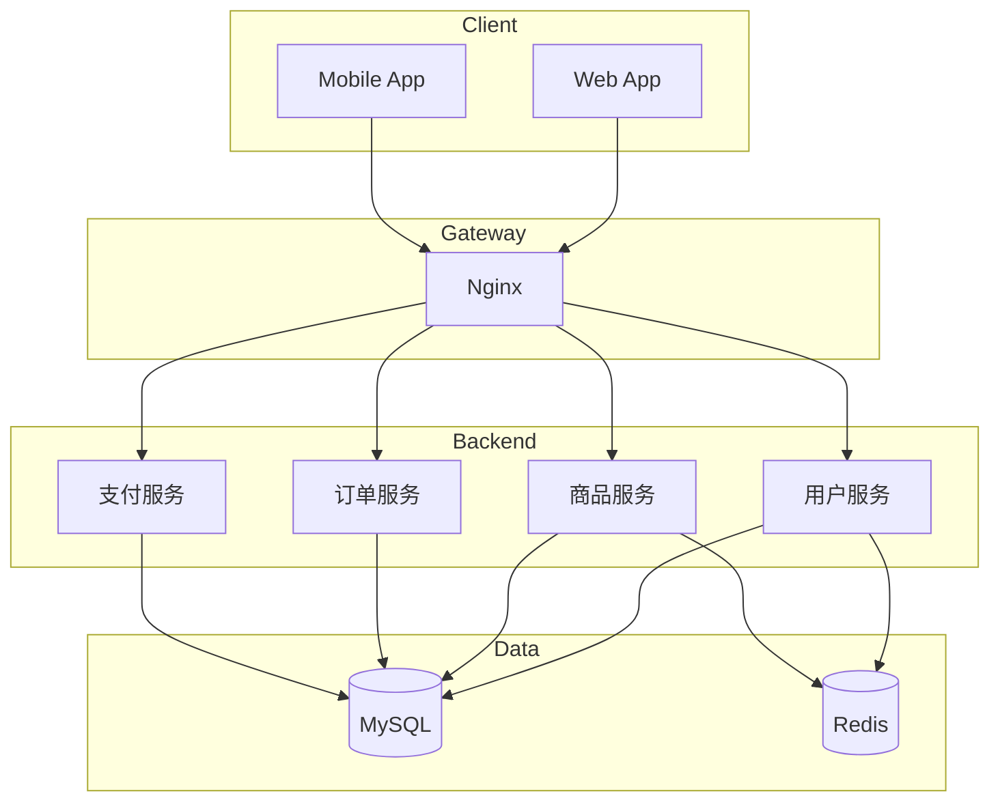
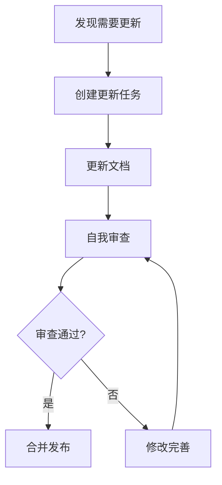

# 项目文档案例

本文介绍如何使用 PowerWiki 管理软件项目的完整文档体系。

## 项目概述

- **项目名称**: 电商平台系统
- **项目周期**: 6 个月
- **团队规模**: 15 人
- **技术栈**: React + Node.js + MySQL + Redis

## 目录结构

```
project-docs/
├── README.md                  # 项目首页
├── ABOUT.md                   # 项目简介
│
├── 需求文档/
│   ├── README.md
│   ├── 产品需求.md
│   ├── 功能列表.md
│   ├── 用户故事.md
│   └── 非功能需求.md
│
├── 设计文档/
│   ├── README.md
│   ├── 系统架构.md
│   ├── 数据库设计.md
│   ├── 接口设计.md
│   └── 流程图/
│       ├── 订单流程.png
│       └── 支付流程.png
│
├── 开发文档/
│   ├── README.md
│   ├── 环境搭建.md
│   ├── 代码规范.md
│   ├── 目录结构.md
│   └── 部署指南.md
│
├── 测试文档/
│   ├── README.md
│   ├── 测试计划.md
│   ├── 测试用例.md
│   └── 测试报告.md
│
├── 用户手册/
│   ├── README.md
│   ├── 快速开始.md
│   ├── 用户指南.md
│   └── 常见问题.md
│
└── 运维文档/
    ├── README.md
    ├── 部署手册.md
    ├── 监控告警.md
    ├── 备份恢复.md
    └── 故障处理.md
```

## 文档生命周期

### 1. 项目启动阶段

```
需求文档 ──→ 设计文档
    │
    ▼
项目立项
```

### 2. 项目开发阶段

```
设计文档 ──→ 开发文档
    │          │
    ▼          ▼
  开发     持续更新
    │
    ▼
测试文档
```

### 3. 项目交付阶段

```
测试文档 ──→ 用户手册
    │
    ▼
项目验收
```

### 4. 项目运维阶段

```
上线 ──→ 运维文档
  │         │
  └─────────┘
   持续更新
```

## 需求文档示例

```markdown
# 产品需求文档

## 1. 项目背景

随着电商行业发展需要，建设一个高性能、高可用的电商平台。

## 2. 功能需求

### 2.1 用户模块

| 功能 | 优先级 | 描述 |
|------|--------|------|
| 用户注册 | P0 | 手机号注册 |
| 用户登录 | P0 | 账号密码登录 |
| 第三方登录 | P1 | 微信登录 |
| 个人信息 | P2 | 查看和修改 |

### 2.2 商品模块

| 功能 | 优先级 | 描述 |
|------|--------|------|
| 商品列表 | P0 | 分页展示商品 |
| 商品详情 | P0 | 查看商品信息 |
| 商品搜索 | P0 | 关键词搜索 |

### 2.3 订单模块

| 功能 | 优先级 | 描述 |
|------|--------|------|
| 创建订单 | P0 | 用户下单 |
| 支付订单 | P0 | 在线支付 |
| 查看订单 | P0 | 订单列表 |

## 3. 非功能需求

- 性能: 接口响应 < 200ms
- 可用性: 99.9%
- 安全: 数据加密传输
```

## 设计文档示例

### 系统架构图



### 数据库设计

```markdown
# 数据库设计

## 用户表 (users)

| 字段 | 类型 | 说明 |
|------|------|------|
| id | BIGINT | 主键 |
| username | VARCHAR(50) | 用户名 |
| password | VARCHAR(255) | 密码 |
| mobile | VARCHAR(20) | 手机号 |
| created_at | DATETIME | 创建时间 |
| updated_at | DATETIME | 更新时间 |

## 商品表 (products)

| 字段 | 类型 | 说明 |
|------|------|------|
| id | BIGINT | 主键 |
| name | VARCHAR(100) | 商品名称 |
| price | DECIMAL(10,2) | 价格 |
| stock | INT | 库存 |
| status | TINYINT | 状态 |
```

## 开发文档示例

```markdown
# 开发指南

## 环境要求

- Node.js >= 16.0.0
- MySQL >= 8.0
- Redis >= 6.0

## 项目结构

```
src/
├── controllers/    # 控制器
├── services/       # 业务逻辑
├── models/         # 数据模型
├── middleware/     # 中间件
├── routes/         # 路由
└── utils/         # 工具函数
```

## 开发流程

1. 从 main 创建分支
2. 开发功能
3. 编写测试
4. 提交 PR
5. 代码审查
6. 合并发布
```

## 测试文档示例

```markdown
# 测试用例

## 用户注册

| 用例ID | 用例名称 | 前提条件 | 测试步骤 | 预期结果 |
|--------|----------|----------|----------|----------|
| TC001 | 正常注册 | 无 | 1. 输入有效信息<br>2. 点击注册 | 注册成功 |
| TC002 | 手机号重复 | 已存在账号 | 1. 输入已注册手机号<br>2. 点击注册 | 提示手机号已注册 |
| TC003 | 格式错误 | 无 | 1. 输入错误格式<br>2. 点击注册 | 提示格式错误 |
```

## 版本管理

### 文档版本

| 版本 | 日期 | 修改人 | 修改内容 |
|------|------|--------|----------|
| v1.0 | 2026-01-01 | 张三 | 初始版本 |
| v1.1 | 2026-01-15 | 李四 | 添加支付功能 |
| v1.2 | 2026-02-01 | 王五 | 添加物流追踪 |

### 文档更新流程



## 模板库

### 会议纪要模板

```markdown
# 项目周会纪要

## 会议信息
- 日期: 2026-02-07
- 参与人: 张三、李四、王五

## 本周进度
- [ ] 任务1: 完成
- [ ] 任务2: 进行中

## 问题与风险
1. 问题1
2. 问题2

## 下周计划
- [ ] 任务A
- [ ] 任务B
```

### 迭代报告模板

```markdown
# 迭代总结报告

## 迭代信息
- 迭代: Sprint 5
- 时间: 2026-01-15 ~ 2026-01-28

## 交付内容
1. 功能1
2. 功能2

## 燃尽图


## 团队表现
- 故事点完成: 25/28
- 缺陷数: 5

## 下迭代计划
- 功能3
- 功能4
```

---

**提示**: 项目文档需要贯穿整个项目生命周期，持续维护和更新。
