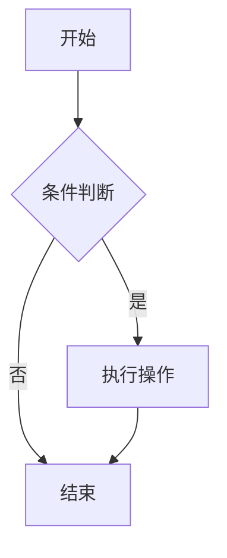
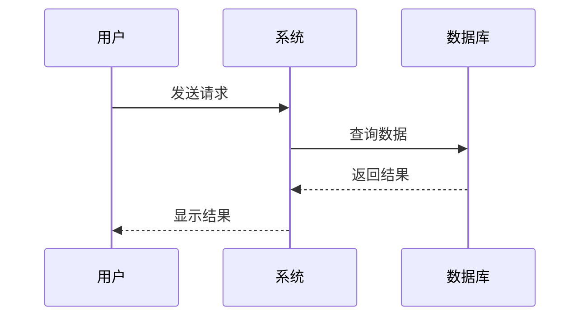
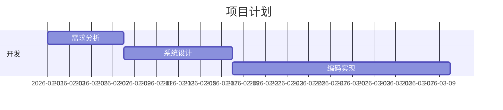
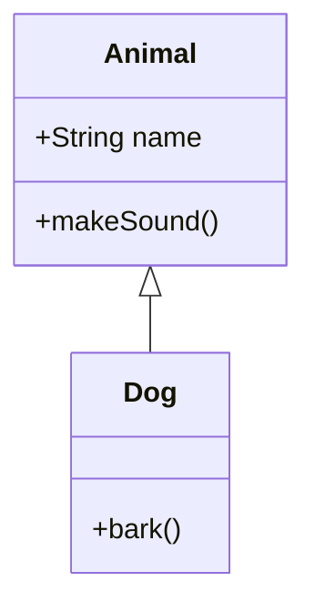
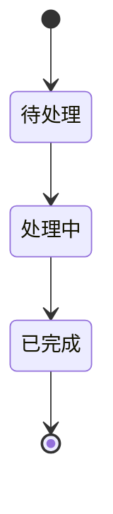
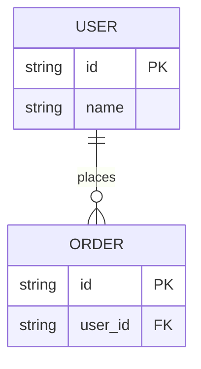
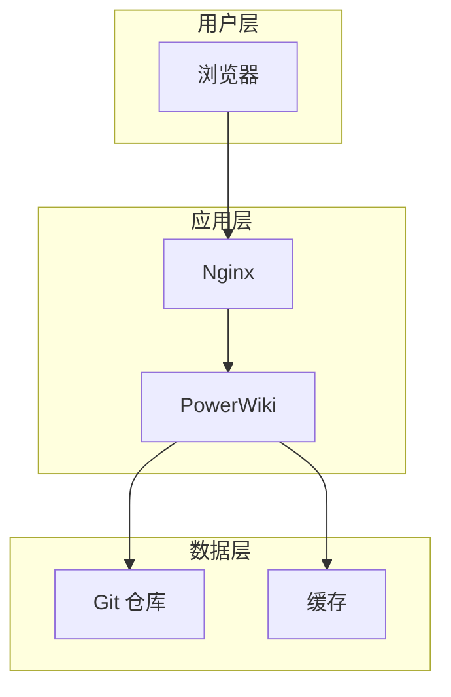
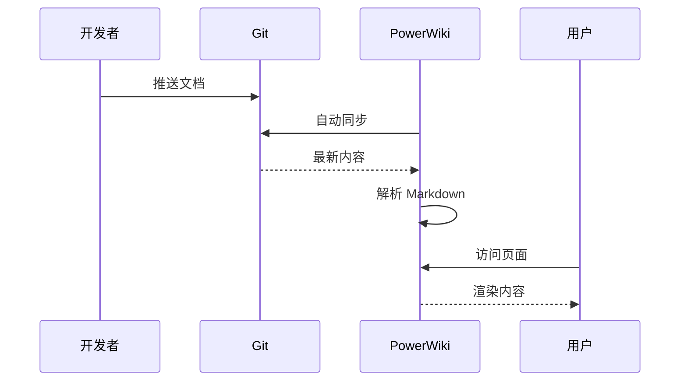

# Mermaid 图表完整指南

PowerWiki 通过 Mermaid 提供强大的图表支持，无需外部工具即可创建各种专业图表。

## 📊 支持的图表类型

### 1. 流程图 (Flowchart)
用于展示业务流程、算法流程、决策流程。

**查看**: [流程图演示](../../功能演示/图表演示/流程图演示.md)

**示例**:

### 2. 时序图 (Sequence Diagram)
用于展示系统间的交互、API 调用、消息传递。

**查看**: [时序图演示](../../功能演示/图表演示/时序图演示.md)

**示例**:

### 3. 甘特图 (Gantt Chart)
用于项目管理、时间规划、任务调度。

**查看**: [甘特图演示](../../功能演示/图表演示/甘特图演示.md)

**示例**:

### 4. 类图 (Class Diagram)
用于面向对象设计、系统架构、UML 建模。

**查看**: [类图演示](../../功能演示/图表演示/类图演示.md)

**示例**:

### 5. 状态图 (State Diagram)
用于展示对象状态、生命周期、状态转换。

**查看**: [状态图演示](../../功能演示/图表演示/状态图演示.md)

**示例**:

### 6. 实体关系图 (ER Diagram)
用于数据库设计、数据建模、实体关联。

**查看**: [实体关系图演示](../../功能演示/图表演示/实体关系图演示.md)

**示例**:

## 🎯 图表对比

| 图表类型 | 用途 | 复杂度 | 适用场景 |
|---------|------|--------|---------|
| 流程图 | 业务流程、算法 | ⭐ | 流程说明、决策树 |
| 时序图 | 系统交互 | ⭐⭐ | API 设计、协议说明 |
| 甘特图 | 项目管理 | ⭐⭐ | 时间规划、任务调度 |
| 类图 | 面向对象设计 | ⭐⭐⭐ | 架构设计、UML |
| 状态图 | 状态转换 | ⭐⭐ | 生命周期、工作流 |
| 实体关系图 | 数据库设计 | ⭐⭐ | 数据建模、ER 图 |

## 💡 使用技巧

### 1. 选择合适的图表类型
- **流程图**: 适合展示步骤和决策
- **时序图**: 适合展示时间顺序的交互
- **甘特图**: 适合展示时间线和依赖关系
- **类图**: 适合展示结构和关系
- **状态图**: 适合展示状态变化
- **ER 图**: 适合展示数据关系

### 2. 保持简洁
- 避免过于复杂的图表
- 一个图表只表达一个主题
- 使用清晰的命名

### 3. 添加说明
- 在图表下方添加文字说明
- 解释关键节点和关系
- 提供上下文信息

### 4. 版本控制
- 图表代码存储在 Markdown 中
- 可以追踪图表的变更历史
- 便于团队协作

## 📖 完整示例

### PowerWiki 架构图

### 部署流程

## 🔗 相关资源

- [Mermaid 官方文档](https://mermaid.js.org/)
- [Mermaid Live Editor](https://mermaid.live/)
- [流程图演示](../../功能演示/图表演示/流程图演示.md)
- [时序图演示](../../功能演示/图表演示/时序图演示.md)
- [甘特图演示](../../功能演示/图表演示/甘特图演示.md)

---

**提示**: Mermaid 图表是 PowerWiki 的核心功能之一，充分利用它可以让您的文档更加生动和易懂。
